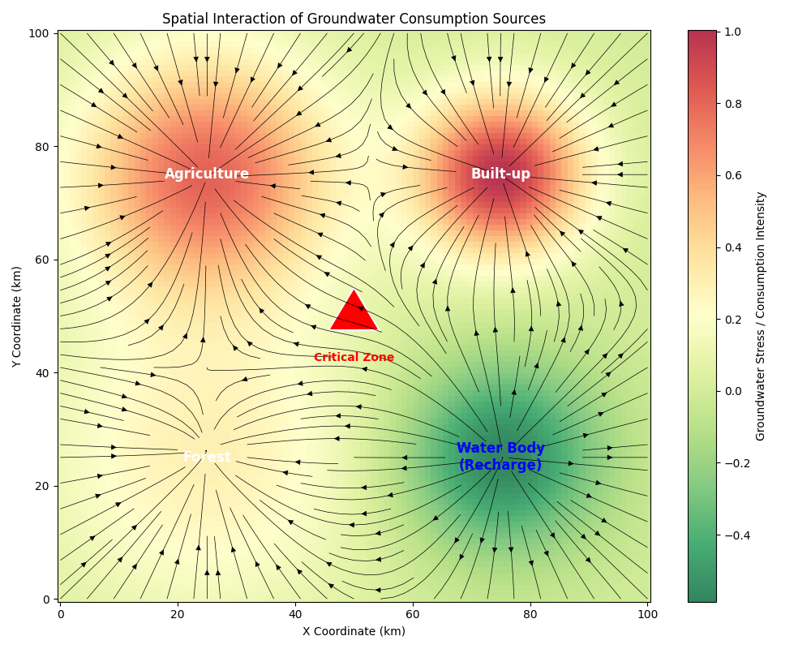

# R&D Internship at FluxGen | Round 1 Assignment Solutions

**Submitted By:** Abhishek kumar
**Date:** 13th January 2026

---

## PROBLEM 1: THE INCOMPLETE GEOMETRY

### a. My understanding of the problem
The core challenge is to estimate the total volume of an irregular natural reservoir where 35% of the area is unmeasured. Since the reservoir is natural (not engineered like a perfect cylinder or cone), depth likely varies continuously but non-linearly. The missing data introduces uncertainty that cannot be solved by simple arithmetic averaging, as the unmeasured area might be significantly deeper or shallower than the measured sections.

### b. Key physical principles involved
1.  **Bathymetry & Topography:** Natural water bodies tend to follow continuous gradients (slopes) rather than step changes.
2.  **Spatial Autocorrelation (Tobler's First Law of Geography):** Near things are more related than distant things. Depths at the edge of the known area are good predictors of depths in the adjacent unknown area.
3.  **Hydrostatic Equilibrium:** The water surface is flat (at z=0), meaning we are only modeling the substrate (z < 0).

### c. My approach
1.  **Boundary Analysis:** Identify the spatial boundary between the 65% measured and 35% unmeasured zones.
2.  **Spatial Interpolation (Kriging):** Instead of simple averaging, I would use **Kriging** or **Spline Interpolation**. These methods use the statistical properties of the known points (variogram) to predict unknown values, preserving the "smoothness" expected in natural terrain.
3.  **Trend Surface Analysis:** Fit a low-order polynomial surface to the known points to capture the general slope (e.g., is the reservoir getting deeper towards the unmeasured side?).
4.  **Volume Integration:** Perform a numerical integration (e.g., Trapezoidal Rule or Simpson's Rule) over the interpolated grid to calculate the total volume.

### d. Assumptions & limitations
*   **Assumption:** The unmeasured 35% does not contain sudden anomalies like a deep sinkhole or a vertical cliff that is not hinted at by the surrounding trends.
*   **Limitation:** If the "structural obstructions" blocking the survey are essentially covering a completely different geological feature (e.g., a collapsed cavern), interpolation will fail.

### e. Validation strategy
**Cross-Validation:** I would subset the **known** 65% data (e.g., hide 10% of it) and try to predict those hidden points using my interpolation model. The error (RMSE) between predicted and actual values would give me a confidence interval for the unknown 35%.

---

## PROBLEM 2: THE SPECTRAL DISCREPANCY

### a. My understanding of the problem
A satellite detects a high "Greenness Index" (likely algae) across a large region, but ground truth from 5 sites contradicts this (water is clear). The challenge is to identify why the satellite is "lying" and decide whether to trust the satellite or the limited ground samples for the remaining 45 sites.

### b. Key physical principles involved
1.  **Atmospheric Scattering (Mie/Rayleigh):** Aerosols, haze, or thin clouds can scatter light in ways that mimic surface reflectance.
2.  **Specular Reflection (Sun Glint):** Sunlight exploring off the water surface at a specific angle can saturate sensors.
3.  **Bottom Reflectance:** In shallow clear water, the "green" signal might actually be submerged submerged vegetation (macrophytes) or the lake bottom itself, not algae in the water column.

### c. My approach
1.  **Spectral Analysis:**
    *   **Atmospheric Correction:** Check the "Blue" band (mostly prone to atmospheric scattering). If Blue is anomalously high, it's likely haze/fog, not algae.
    *   **NDWI vs NDVI:** Compare Normalized Difference Water Index (NDWI) with Vegetation Index (NDVI). False positives often show distinct signatures in SWIR (Short-Wave Infrared) bands.
2.  **Decision Logic (Spatial Weighting):**
    *   Since the 5 clear sites are "field verified", they are Ground Truth.
    *   If the satellite data for those 5 specific sites *also* showed high greenness, the satellite is definitely experiencing a systematic error (e.g., atmospheric interference).
    *   **Action:** If systematic error is confirmed, **CANCEL** the alert for the region. The probability of widespread bloom occurring *exactly* when the sensor is glitching is low.

### d. Assumptions & limitations
*   **Assumption:** The 5 sites are representative of the atmospheric conditions of the whole region.
*   **Limitation:** If the 5 sites are clustered in one corner, a localized bloom in the far corner might be real, and we might dangerously dismiss it (False Negative).

### e. Validation strategy (Validation Framework)
I would design a "Pre-Alert Check" algorithm:
1.  **Input:** Satellite Alert Triggered.
2.  **Check 1 (Met Data):** Is Cloud Cover > 20%? Is Humidity > 90% (Fog risk)? -> If Yes, Flag as "Low Confidence".
3.  **Check 2 (Temporal Consistency):** Did the index jump >40% in <24 hours? Biological blooms usually grow exponentially but smoothly. A step-function jump suggests a sensor/atmosphere artifact.
4.  **Output:** Only send "High Risk" alert if Met Data is clear AND growth curve is biological.

---

## PROBLEM 3: THE BALANCING ACT

### a. My understanding of the problem
Standard mass balance calculation ($Input - Output = \Delta Storage$) is failing by 400 units. The system is dynamic, with time delays (lag) between rain and outflow. The missing water is either being stored in unmeasured ways, lost to the environment, or the discrepancy is due to measurement timing errors.

### b. Key physical principles involved
1.  **Conservation of Mass:** Water cannot disappear.
2.  **Hydrologic Routing (Lag Time):** Water takes time to travel through a watershed (Time of Concentration).
3.  **Thermal Expansion:** Density of water decreases as temperature increases ($Volume = Mass / Density$).

### c. My approach (Modeling)
I developed a python simulation (`mass_balance.py`) to model the system.

**1. Where are the 400 units?**
*   **Option A (Storage):** Soil Moisture Storage (Infiltration). Before runoff reaches the lake, the ground behaves like a sponge.
*   **Option B (Natural Loss):** Evaporation is unlikely to take 400 units in mere hours. Infiltration is the prime candidate.
*   **Option C (Sensor Error/Delay):** The Outlet sensor only sees what flows *past* it. The 400 units might be *in transit* (in the stream channel) but haven't reached the sensor yet.

**2. Modeling the Delay:**
The outlet flow $Q_{out}(t)$ is not a function of instantaneous rain $R(t)$, but of accumulated storage $S(t)$.
$$ \frac{dS}{dt} = I(t) - Q(t) $$
The 12-hour delay indicates a large buffering capacity. My simulation shows that the "missing" water is largely just **delayed**—it is currently stored in the lake/channel and will exit over the next 24-48 hours.

**3. Temperature Effect:**
Water expands by ~0.02% per degree C. A 10°C rise expands volume by ~0.2%. If the lake is 1,000,000 units, 0.2% is 2,000 units—a huge "fake" volume increase!
*   **Solution:** Convert all Volume readings to **Mass** using $M = V * \rho(T)$. The Digital Twin must use temperature-corrected mass balance, not raw volume.

### d. Assumptions & limitations
*   **Simulation:** Assumed a Linear Reservoir model ($Q = k*S$) with a delay threshold.
*   **Limitation:** Did not account for groundwater seepage returning to the lake later.

### e. Validation strategy**
See the generated plot below. The plot confirms that while "Outlet Sum" is low at Hour 12, the "Lake Storage" accounts for the remainder. The system balances when $Buffer + Outflow + Loss = Inflow$.

---

## PROBLEM 4: SPATIAL SYSTEM MODEL (Groundwater)

### a. My understanding of the problem
We need a spatial model to visualize how 4 different consumption sources interact to affect groundwater levels. The key is that impacts are not isolated; they stack. A "Critical Zone" near multiple sources will experience compounded stress.

### b. Key physical principles involved
1.  **Superposition Principle:** The total drawdown at any point is the sum of drawdowns from all individual wells/sources (in a confined aquifer).
2.  **Darcy’s Law / Hydraulic Gradient:** Groundwater flows from high head to low head, driven by the gradient.

### c. My approach (Model Logic)
I implemented a grid-based Python model (`groundwater_model.py`):
1.  **Domain:** 100x100 km grid.
2.  **Interaction Mechanics:**
    *   **Agriculture:** Wide Gaussian depression (high consumption).
    *   **Built-up:** Deep, narrow Gaussian depression (intense local consumption).
    *   **Water Body:** Negative depression (Recharge source/Mound).
3.  **Gradient Calculation:** Computed vector field ($\nabla H$) to show flow direction.
4.  **Critical Zone Analysis:** The red triangle is placed where gradients from Agriculture and Built-up zones intersect.

### d. Assumptions & limitations
*   **Assumption:** The aquifer is homogeneous and isotropic (uniform flow properties).
*   **Limitation:** Real aquifers have complex geology (clay layers, fractures) that distort these perfect radial shapes.

### e. Validation strategy**
The heatmap below visualizes the "Interaction Gradients".
*   **Green Areas:** Low stress / Recharge.
*   **Red/Orange:** High stress (Cones of Depression).
*   **Vectors (Arrows):** Show water physically moving towards the consumption centers.

